# Designs
The table below details all 10 official DLC designs, including download links for preserved patterns and other key details:

| Descriptive name    |                        Screenshot                        |                      Textures                      | Style       | Type     | Region           | Pattern files                                                                                                                                                                                                                           |
|---------------------|:--------------------------------------------------------:|:--------------------------------------------------:|-------------|----------|------------------|-----------------------------------------------------------------------------------------------------------------------------------------------------------------------------------------------------------------------------------------|
| Mayor's flag        |                                                          |          | Strange     | Standard | North America    | [English](patterns/Mayor's%20flag%20US.pat), [Spanish](patterns/Mayor's%20flag%20MX.pat), **FRENCH MISSING**                                                                                                                            |
| Guard's uniform     |   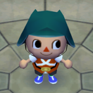    |       | Cool        | Pro      | North America    | [English](patterns/guard's%20uniform%20US.pat), [Spanish](patterns/guard's%20uniform%20MX.pat), **FRENCH MISSING**                                                                                                                      |
| Flamenco dress      |   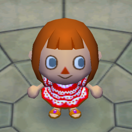    |   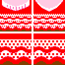    | Gaudy       | Pro      | Europe/Australia | [English](patterns/flamenco%20dress%20EN.pat), [German](patterns/flamenco%20dress%20DE.pat), [Italian](patterns/flamenco%20dress%20IT.pat), [Spanish](patterns/flamenco%20dress%20ES.pat), [French](patterns/flamenco%20dress%20FR.pat) |
| Dirndl dress        |    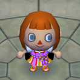     |    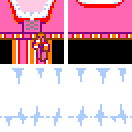     | Cute        | Pro      | Europe/Australia | [English](patterns/dirndl%20dress%20EN.pat), [German](patterns/dirndl%20dress%20DE.pat), [Italian](patterns/dirndl%20dress%20IT.pat), [Spanish](patterns/dirndl%20dress%20ES.pat), [French](patterns/dirndl%20dress%20FR.pat)           |
| Student uniform     |   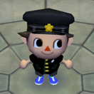   |      | Refined     | Pro      | Japan            | [Japanese](patterns/student%20uniform.pat)                                                                                                                                                                                              |
| Red chanchanko      |   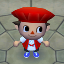    |   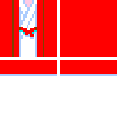    | Gaudy       | Pro      | Japan            | [Japanese](patterns/red%20chanchanko.pat)                                                                                                                                                                                               |
| Kintaro apron       |                       **MISSING**                        |                    **MISSING**                     | **MISSING** | Pro      | Japan            | **MISSING**                                                                                                                                                                                                                             |
| Colorful hanbok     |   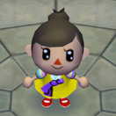   |      | Subtle      | Pro      | Korea            | [Korean](patterns/colorful%20hanbok.pat)                                                                                                                                                                                                |
| Hangul shirt        |         |    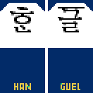     | Striking    | Pro      | Korea            | [Korean](patterns/Hangul%20shirt.pat)                                                                                                                                                                                                   |
| Victory Korea shirt | 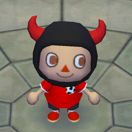 | 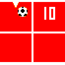 | Cool        | Pro      | Korea            | [Korean](patterns/Victory%20Korea%20shirt.pat)                                                                                                                                                                                          |

The following table provides the official localized names for each design across all applicable in-game languages:

| Descriptive name    | English             | German             | Italian            | Spanish              | French             | Japanese       | Korean          |
|---------------------|---------------------|--------------------|--------------------|----------------------|--------------------|----------------|-----------------|
| Mayor's flag        | ``Mayor's flag``    | *n/a*              | *n/a*              | ``bandera Alcalde``  | **MISSING**        | *n/a*          | *n/a*           |
| Guard's uniform     | ``guard's uniform`` | *n/a*              | *n/a*              | ``uniforme guardia`` | **MISSING**        | *n/a*          | *n/a*           |
| Flamenco dress      | ``flamenco dress``  | ``Flamenco-Dress`` | ``veste flamenco`` | ``traje flamenco``   | ``tenue flamenco`` | *n/a*          | *n/a*           |
| Dirndl dress        | ``dirndl dress``    | ``Dirndl``         | ``abito bavarese`` | ``traje bávaro``     | ``robe bavaroise`` | *n/a*          | *n/a*           |
| Student uniform     | *n/a*               | *n/a*              | *n/a*              | *n/a*                | *n/a*              | ``がくせいふく``     | *n/a*           |
| Red chanchanko      | *n/a*               | *n/a*              | *n/a*              | *n/a*                | *n/a*              | ``あかいちゃんちゃんこ`` | *n/a*           |
| Kintaro apron       | *n/a*               | *n/a*              | *n/a*              | *n/a*                | *n/a*              | ``きんたろうのはらがけ`` | *n/a*           |
| Colorful hanbok     | *n/a*               | *n/a*              | *n/a*              | *n/a*                | *n/a*              | *n/a*          | ``색동 한복``       |
| Hangul shirt        | *n/a*               | *n/a*              | *n/a*              | *n/a*                | *n/a*              | *n/a*          | ``한글 티셔츠``      |
| Victory Korea shirt | *n/a*               | *n/a*              | *n/a*              | *n/a*                | *n/a*              | *n/a*          | ``필승 코리아 티셔츠``  |

## Authenticity
To guarantee the integrity of the preserved designs, all pattern data dumped from save files is verified manually. Because custom patterns can easily be recreated or modified in-game, a design is only classified as authentic if it meets specific technical criteria that cannot be replicated through normal gameplay:
1) The design's internal creator name must be set to *Wendell* from the town *Sumware*. Depending on the save's language, these names have to match the respective localized names.
2) Several officially distributed designs contain anomalies within their texture bitmaps. Patterns are stored as 4-bit per pixel (4bpp) indexed images. This allows a pixel to reference one of 16 palette color slots. These colors are indexed 0 through 15. However, the in-game design editor strictly restricts player selection to palette slots 1 through 15. Four official designs (*flamenco dress*, *dirndl dress*, *colorful hanbok*, and *Hangul shirt*) utilize color index 0, which is completely inaccessible via the in-game editor. The game renders these colors as white. Because players cannot select or draw with color index 0, replicating these exact bitmaps through normal gameplay is technically impossible.
3) The pattern data must contain a non-default clothing style value. Any design created, edited or saved by a human player lacks this specific style value. Even if a player attempts to replicate an official design by hand in the Able Sister shop, the resulting data will lack a non-default style value.

## Sources
Numerous sources were considered for preserving these designs. In fear that some media gets taken down in the future, I also added screenshots for all web-based sources which you can find down below.

### Pattern dumps
- *Flamenco dress* and *dirndl dress* were dumped from a German save file discovered on an old online forum.
- *Mayor's flag* and *guard's uniform* were dumped from save data supplied by *emilyosaurus* on June 9, 2025.
- *Colorful hanbok*, *Hangul shirt*, and *Victory Korea shirt* were dumped from save data supplied by *Joons Choi* on October 2, 2026.
- *Student uniform* and *red chanchanko* were obtained from an unknown source a long time ago.

### Localized names
- All localized names for the *flamenco dress* were found on and confirmed using the official Nintendo websites:
  - English: [UK & Ireland page](https://www.nintendo.com/en-gb/News/2009/Celebrate-in-Animal-Crossing-flamenco-style--251005.html) (published April 22, 2009)
  - German: [Deutschland page](https://www.nintendo.com/de-de/News/2009/Feiern-Sie-in-Animal-Crossing-im-Flamencostil--251005.html) (published April 22, 2009)
  - Italian: [Italia page](https://www.nintendo.com/it-it/Notizie/2009/Festeggia-in-Animal-Crossing-con-un-tocco-di-flamenco--251005.html) (published April 22, 2009)
  - Spanish: [España page](https://www.nintendo.com/es-es/Noticias/2009/-Llega-la-fiebre-flamenca-a-Animal-Crossing--251005.html) (published April 22, 2009)
  - French: [France page](https://www.nintendo.com/fr-fr/News/2009/Faites-la-fiesta-a-Animal-Crossing--251005.html) (published April 22, 2009)
- All localized names for the *dirndl dress* were found on and confirmed using the official Nintendo websites:
  - English: [UK & Ireland page](https://www.nintendo.com/en-gb/News/2009/Get-down-and-party-in-a-dirndl-dress--251161.html) (published September 17, 2009)
  - German: [Deutschland page](https://www.nintendo.com/de-de/News/2009/Party-im-Dirndl-251161.html) (published September 17, 2009)
  - Italian: [Italia page](https://www.nintendo.com/it-it/Notizie/2009/Divertiti-indossando-l-abito-bavarese--251161.html) (published September 17, 2009)
  - Spanish: [España page](https://www.nintendo.com/es-es/Noticias/2009/-Unete-a-la-fiesta-vestido-con-un-tradicional-traje-bavaro--251161.html) (published September 17, 2009)
  - French: [France page](https://www.nintendo.com/fr-fr/News/2009/Faites-la-fete-en-tenue-traditionnelle-bavaroise--251161.html) (published September 17, 2009)
- The Spanish name of the *Mayor's flag* can be seen in [this YouTube video](https://www.youtube.com/watch?v=UPJ02CObxbM) by **PowerCrossingChannel** (uploaded June 13, 2009.) In this video, the player obtains the design from Wendell, showing the actual name ingame.
- The Spanish name of the *guard's uniform* was confirmed in [this YouTube comment](https://www.youtube.com/post/UgkxbYAi6uyvNj5tz7KIKT3zGIBS1VaM_7Tq?lc=Ugxrqp41advD6lGBTQV4AaABAg) by YouTube user **Totavier**. The original comment was posted on June 10, 2025 below a community post by YouTuber Hunter R.

### Screenshots
#### Video by *PowerCrossingChannel* confirming the Spanish name of the *Mayor's flag*
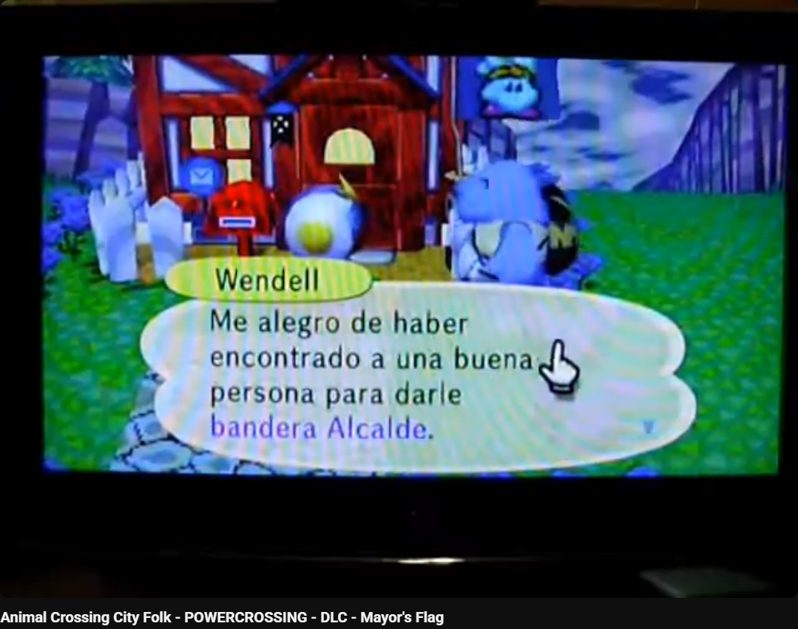

#### Comment by *Totavier* confirming the Spanish name of the *guard's uniform*
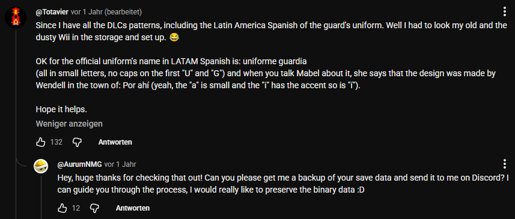

#### Nintendo website pages about the *flamenco dress*
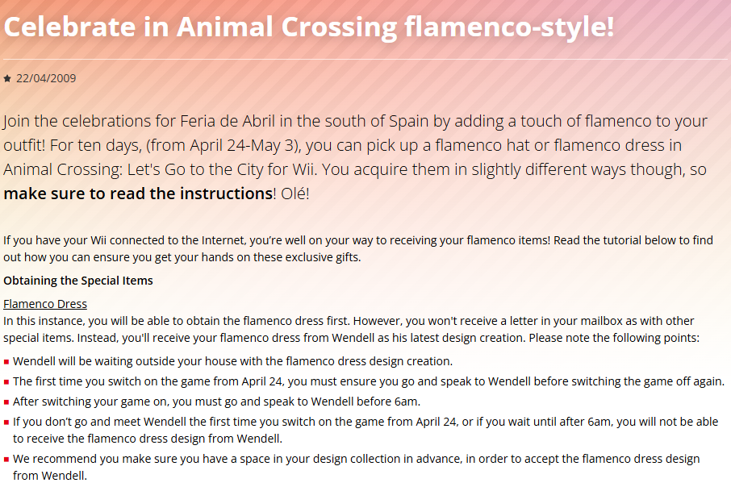
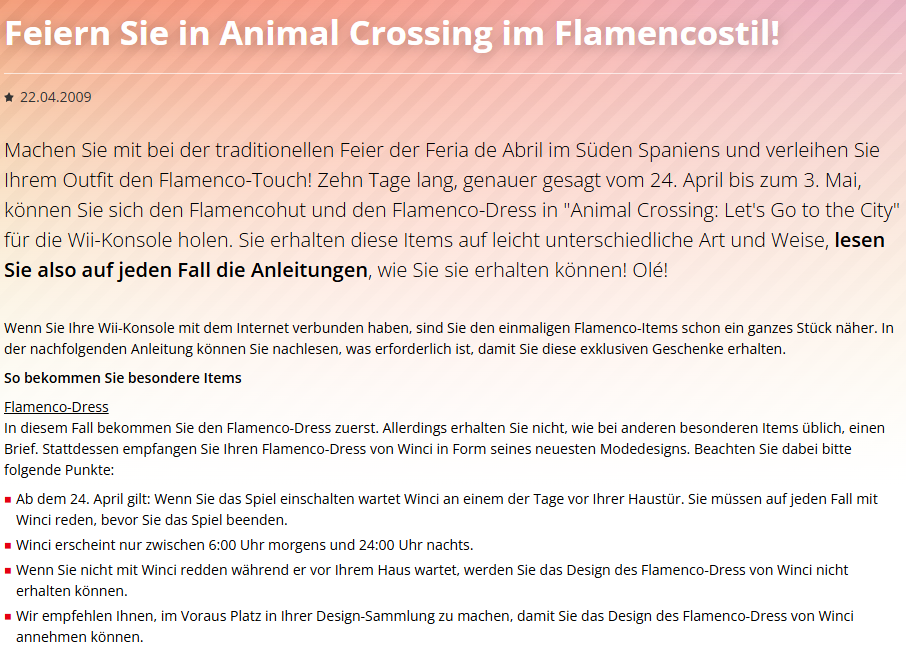
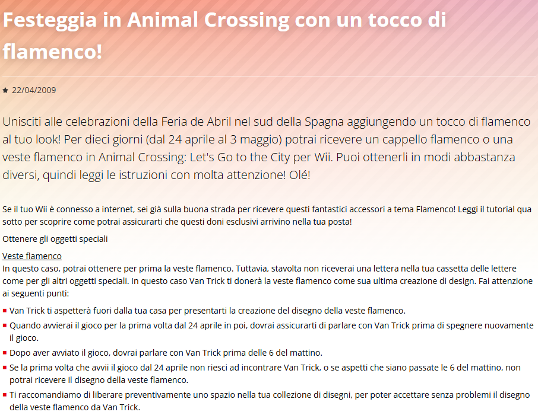
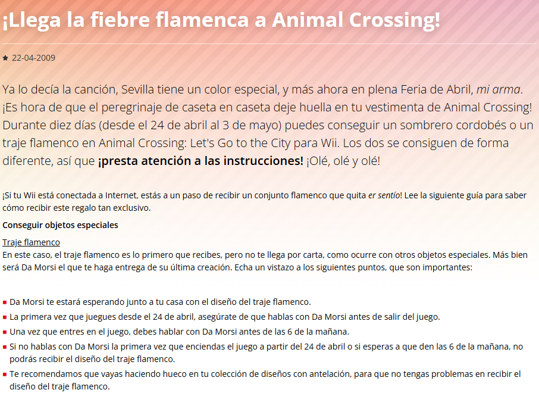
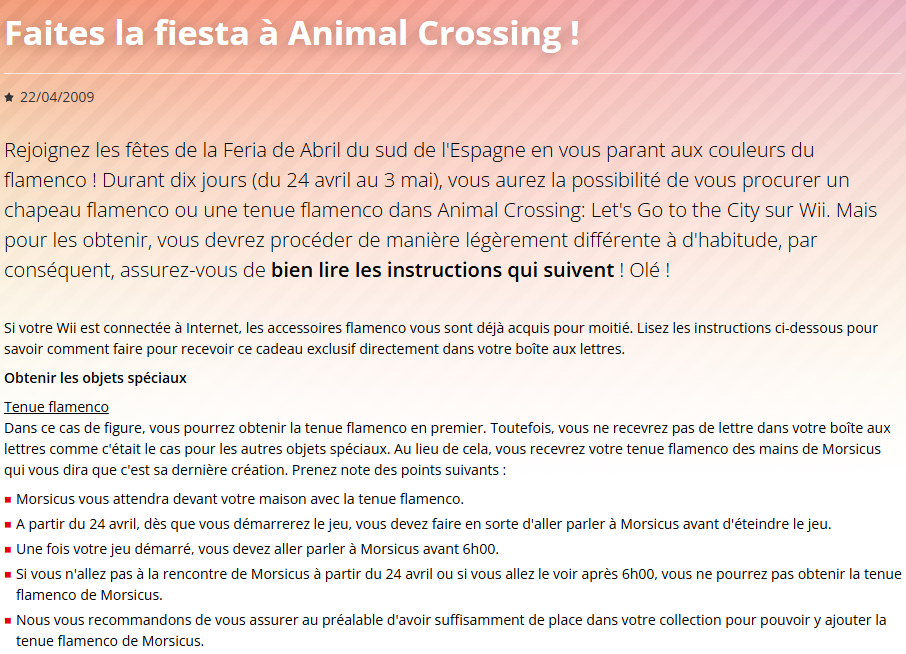

#### Nintendo website pages about the *dirndl dress*
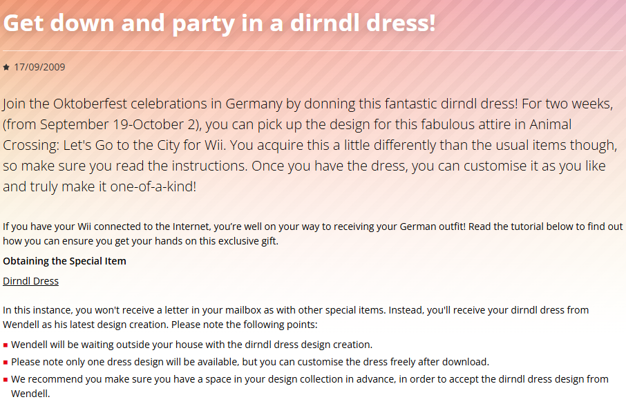
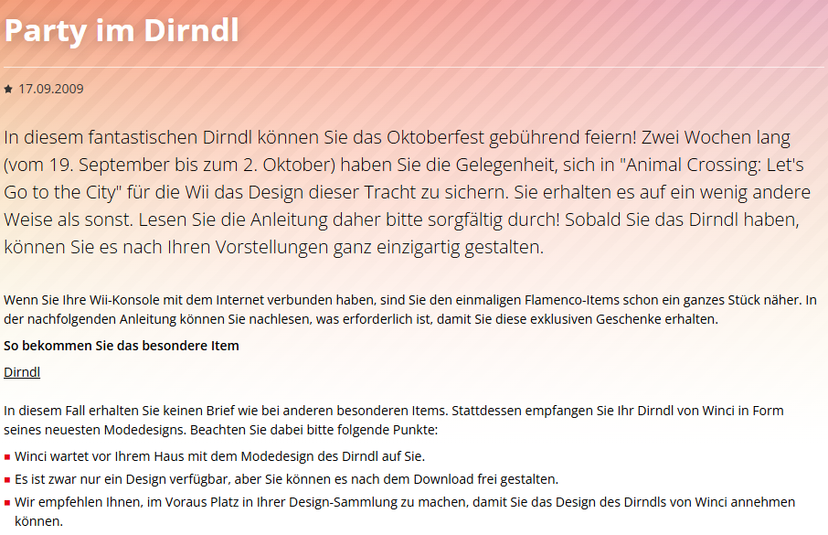
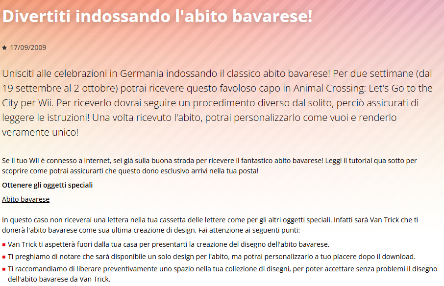
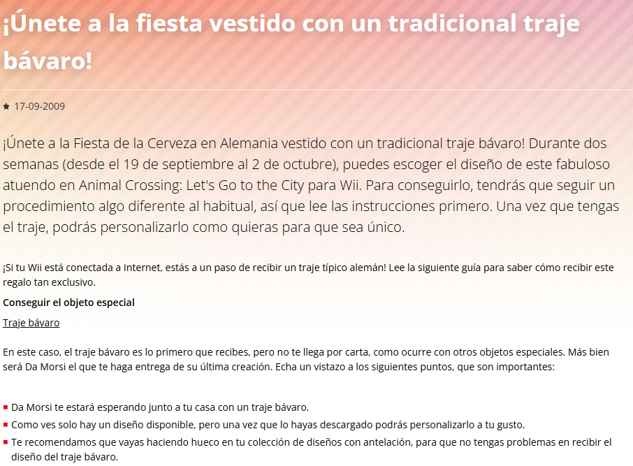
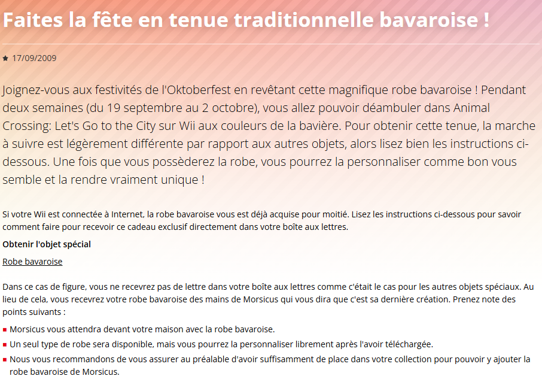
