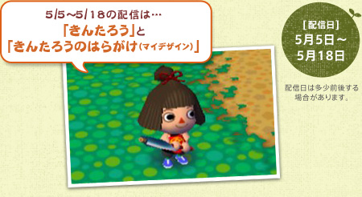
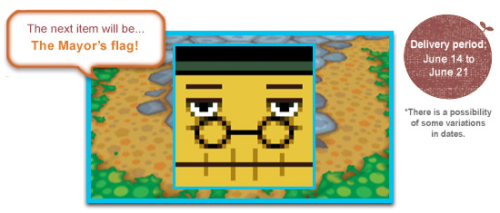
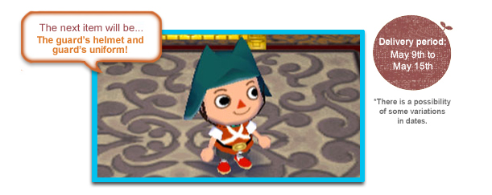

# Animal Crossing: City Folk DLC Preservation
**Animal Crossing: City Folk** (also known as **Let's Go to the City** in Europe and Australia) featured a lot of extra
content released post-launch via WiiConnect24, including 91 new items and 10 exclusive designs. The player would receive
distributed items in special letters that were hand-delivered by Pete whereas designs were obtained from Wendell. This
project aims to preserve all the DLC-related content of *Animal Crossing: City Folk*. However, since the distribution
data was only shared in very small timeframes, getting hold of authentic data is very difficult and requires many save
files to be analyzed. Thanks to community efforts, all items (including three unreleased ones), most designs and a bunch
of letters have already been preserved. But there's still a lot left to preserve.

**If you played the game during 2008 to 2013, there's a very high chance that your save data still contains DLC-related
data. You can easily contribute by sharing your save data or by providing screenshots in case you don't want to dump
your save data. Down below you can find an overview of information that's still missing as well as various methods of
dumping your own save data. Generally, feel free to reach out on my Discord server (https://discord.gg/C3px4rejUX) or
via e-mail ([aurumsmods@gmail.com](mailto:aurumsmods@gmail.com)). With a few steps, you can easily contribute to this
preservation effort. Huge thanks in advance!**

## Preservation results
- [Letters](LETTERS.md): All letters received from Nintendo and their preservation status.
- [Designs](DESIGNS.md): Every DLC design and downloadable ``.pat`` files of preserved designs.
- [Items](ITEMS.md): Information on all 94 fully-preserved official DLC items, including unreleased ones.
- [Indices](INDICES.md): The known internal indices for all released design and item DLC packages.
- [Credits](CREDITS.md): Everyone who helped in making this preservation effort possible.

## What we need help finding
- All Nintendo letters that are currently missing. See the [letters page](LETTERS.md) for the current status.
- **Japan-exclusive design "Kintaro apron"** (きんたろうのはらがけ). Recreations exist, but I need to extract authentic data from save data.
- Official **Canadian French** names for the **Mayor's flag** and **guard's flag** designs as they appeared in-game.

  

## How you can help
Luckily, to contribute to this project, there's not much you'd have to do. All that I are the extracted ``rvforest.dat``
and ``wc24dl.vff`` files of the game's save data. Extracting those files requires a homebrew app such as *SaveGame
Manager GX* ([WiiBrew page](https://wiibrew.org/wiki/SaveGame_Manager_GX), 
[Open Shop Channel](https://oscwii.org/library/app/SaveGame_Manager_GX)). However, if you do not want to mod your
console, you can also create a NAND backup which leaves your Wii completely unmodified. In general, the process of
dumping your save data takes 5 minutes if you already have homebrew and 30 to 60 minutes otherwise.

Installing homebrew on a retail Wii/Wii U console is a very simple and save process nowadays. Breaking your console is
practically impossible if you clearly follow guides on setting up homebrew. I generally recommend the
[Wii Hacks Guide](https://wii.hacks.guide/) for modding your Wii system. 

However, if you do not want to permanently mod your console, you can also easily make a NAND backup which you can then
import into Dolphin Emulator to access the save files on a computer. This process demands a little bit more time.

**In case you need help performing these steps, feel free to contact me ([Discord](https://discord.gg/C3px4rejUX), 
[e-mail](mailto:aurumsmods@gmail.com))!**

UNCERTAIN, MAY BE REMOVED:

### Where to check in your game
Launch your game and check the following locations for these designs:

- Your player character's **design inventory** which holds up to eight custom patterns.
- **Speak with Mabel** inside the Able Sisters shop and check your saved **design storage**.
- Check the designs displayed on the **clothing racks in the Able Sisters shop**.

### What to do if you find something
If you spot the **Kintaro apron** or have a Canadian French game set up with the **Mayor's flag** or **guard's uniform**:

- **Do not erase or overwrite the pattern slots.**
- Reach out directly [on my Discord server](https://discord.gg/C3px4rejUX) or via e-mail at [aurumsmods@gmail.com](mailto:aurumsmods@gmail.com).
- I will gladly walk you through the process of getting me the correct screenshots or safely backing up your Wii save data.
